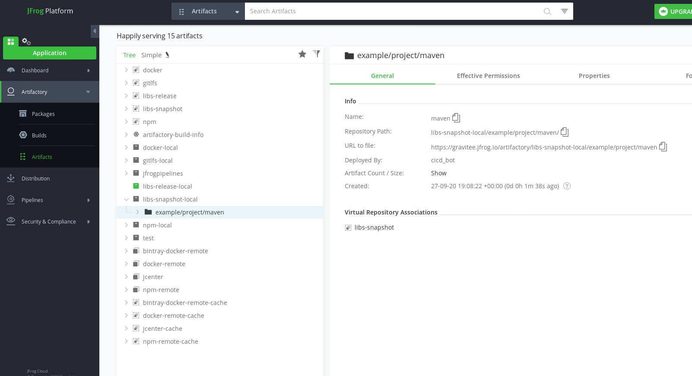

# Gravitee dry run deployment to artifactory prototype

A simple Repo, to design the automation recipe to `mvn clean deploy` all Gravitee maven projects to a dry run maven central repository service (artifactory).


* initialize source code :

```bash
git clone git@github.com:gravitee-lab/clever-cloud-artifactory-deployment-prototype.git
cd ~/clever-cloud-artifactory-deployment-prototype/ && atom .
git flow init --defaults
export FEATURE_ALIAS="init_src_code"
git flow feature start "${FEATURE_ALIAS}"

cd ~/
rm -fr ~/workytempfolder
git clone https://github.com/gravitee-lab/jfrog-activation-guardian ~/workytempfolder
cd ~/workytempfolder
git checkout 0.0.25

cp -fR ./* ~/clever-cloud-artifactory-deployment-prototype/

rm -fr ~/clever-cloud-artifactory-deployment-prototype/simple-mvn-prj/
mkdir -p ~/clever-cloud-artifactory-deployment-prototype/simple-mvn-prj/
cp -fR ~/clever-cloud-artifactory-deployment-prototype/guard-shift/* ~/clever-cloud-artifactory-deployment-prototype/simple-mvn-prj/
rm -fr ~/clever-cloud-artifactory-deployment-prototype/guard-shift/

rm -fr ~/clever-cloud-artifactory-deployment-prototype/.circleci/
mkdir -p ~/clever-cloud-artifactory-deployment-prototype/.circleci/
cp -fR ./.circleci/* ~/clever-cloud-artifactory-deployment-prototype/.circleci/

cd ~/
rm -fr ~/workytempfolder

# ---
# -- init gravtiee component source code
git clone https://github.com/gravitee-lab/gravitee-common ~/workytempfolder
cd ~/workytempfolder
git checkout 1.18.x
rm -fr ~/clever-cloud-artifactory-deployment-prototype/gio-maven-project/
mkdir -p ~/clever-cloud-artifactory-deployment-prototype/gio-maven-project/
cp -fR ./* ~/clever-cloud-artifactory-deployment-prototype/gio-maven-project/

# ---
# and go IDE
cd ~/clever-cloud-artifactory-deployment-prototype/
atom .
export FEATURE_ALIAS="init_src_code"
export COMMIT_MESSAGE="feat.(${FEATURE_ALIAS}): adding base source code"
# git flow feature start "${FEATURE_ALIAS}"
git add --all && git commit -m "${COMMIT_MESSAGE}" && git push -u origin HEAD
# git push -u origin --all
# git flow release start
# git push -u origin --all && git push -u origin --tags
```

## maven deploy plugin

* https://maven.apache.org/guides/mini/guide-3rd-party-jars-remote.html

```bash
mvn deploy:deploy-file -DgroupId=<group-id> \
  -DartifactId=<artifact-id> \
  -Dversion=<version> \
  -Dpackaging=<type-of-packaging> \
  -Dfile=<path-to-file> \
  -DrepositoryId=<id-to-map-on-server-section-of-settings.xml> \
  -Durl=<url-of-the-repository-to-deploy>
```


## `Cron` Config

I want the Pipeline to run once a week, On sunday at midnight :

* The Cron configuration for that frequency is :

```ini
0 0 * * 0
```

* test config every 5 minutes: ( `*/5` _cron step syntax_ not supported by Circle CI )

```ini
*/5 * * * *
```

* test config every minute :

```ini
* * * * *
```


## Secrets Initialization

```bash
export SECRETHUB_ORG="gravitee-lab"
export SECRETHUB_REPO="cicd"
secrethub org init "${SECRETHUB_ORG}"
secrethub repo init "${SECRETHUB_ORG}/${SECRETHUB_REPO}"

# --- #
# for the DEV CI CD WorkFlow of
# the Gravitee CI CD Orchestrator
secrethub mkdir --parents "${SECRETHUB_ORG}/${SECRETHUB_REPO}/graviteebot/infra/maven/dry-run/artifactory/"

# --- #
# write quay secrets for the DEV CI CD WorkFlow of
# the Gravitee CI CD Orchestrator
export ARTIFACTORY_BOT_USER_NAME="cicd_bot"
export ARTIFACTORY_BOT_USER_PWD="inyourdreams;)"


echo "${ARTIFACTORY_BOT_USER_NAME}" | secrethub write "${SECRETHUB_ORG}/${SECRETHUB_REPO}/graviteebot/infra/maven/dry-run/artifactory/user-name"
echo "${ARTIFACTORY_BOT_USER_PWD}" | secrethub write "${SECRETHUB_ORG}/${SECRETHUB_REPO}/graviteebot/infra/maven/dry-run/artifactory/user-pwd"

secrethub read "${SECRETHUB_ORG}/${SECRETHUB_REPO}/graviteebot/infra/maven/dry-run/artifactory/user-name"
secrethub read "${SECRETHUB_ORG}/${SECRETHUB_REPO}/graviteebot/infra/maven/dry-run/artifactory/user-pwd"


sed -i "s#ARTIFACTORY_BOT_USER_NAME#${ARTIFACTORY_BOT_USER_NAME}#g" ./dry-run-conf/settings.xml
sed -i "s#ARTIFACTORY_BOT_USER_PWD#${ARTIFACTORY_BOT_USER_PWD}#g" ./dry-run-conf/settings.xml

secrethub write --in-file ./dry-run-conf/settings.xml "${SECRETHUB_ORG}/${SECRETHUB_REPO}/graviteebot/infra/maven/dry-run/artifactory/settings.xml"
secrethub read --out-file ./test.retrievieving.settings.xml "${SECRETHUB_ORG}/${SECRETHUB_REPO}/graviteebot/infra/maven/dry-run/artifactory/settings.xml"
cat ./test.retrievieving.settings.xml

echo "Or a single secret file, the [settings.xml] ...?"
echo "${ARTIFACTORY_BOT_USERNAME}" | secrethub write "${SECRETHUB_ORG}/${SECRETHUB_REPO}/graviteebot/infra/artifactory/username"
echo "${ARTIFACTORY_BOT_SECRET}" | secrethub write "${SECRETHUB_ORG}/${SECRETHUB_REPO}/graviteebot/infra/artifactory/password"
echo "Or a single secret file, the [settings.xml] ...?"

```
* creating secrethub service account with permissions to access secrets in `gravitee-lab/cicd-infra` repo :

```bash
export NAME_OF_REPO_IN_ORG="gravitee-lab/cicd-infra"
secrethub service init "${NAME_OF_REPO_IN_ORG}" --description "Circle CI Service for Gravitee CI CD Orchestrator" --permission read | tee ./.the-created.service.token
```
* Then created a Circle CI Org context `cicd-infra`, and in that context, the `SECRETHUB_CREDENTIAL` env. var. with value, the token in output of the `service init` command

## Packaging and deployment to JFrog


Here is a sample script of what the Circle CI Pipeline basically executes :

```bash

# commandes maven

export GUARDIAN_GIT_URI="https://github.com/gravitee-lab/gravitee-gateway"
mkdir -p "$PWD/guard-shift"
git clone "${GUARDIAN_GIT_URI}" $PWD/guard-shift
cd ${MVN_LAB}

# mapping [ -v "$PWD/target:/usr/src/mymaven/target" ] requires to create a docker image to manage UID GID of linux user inside and outside container
# docker run -it --rm -v "$PWD":/usr/src/mymaven -v "$HOME/.m2":/root/.m2 -v "$PWD/target:/usr/src/mymaven/target" -w /usr/src/mymaven maven mvn clean package

# To run mvn clean package:
# [-v "$PWD":/usr/src/mymaven] :  maps the source code inside container
# [-v "$HOME/.m2":/root/.m2] : maps the maven [.m2] on my workstation to the one inside the container. I will ust this one to use settings.xml
# docker run -it --rm -v "$PWD":/usr/src/mymaven -v "$HOME/.m2":/root/.m2 -w /usr/src/mymaven maven mvn clean package
# To run mvn clean package release :
# all gravtiee java pom projects are [https://github.com/gravitee-io/gravitee-parent/]

export JFROG_BUILD_NUMBER='158468578'
#
# see https://github.com/jfrog/project-examples/tree/master/artifactory-maven-plugin-example
export JFROG_USERNAME_DEV=$(secrethub read gravitee-lab/cicd-infra/dev/jfrog/username)
export JFROG_SECRET_DEV=$(secrethub read gravitee-lab/cicd-infra/dev/jfrog/password)
echo "JFROG_USERNAME_DEV=[${JFROG_USERNAME_DEV}]"
echo "JFROG_BUILD_NUMBER=[${JFROG_BUILD_NUMBER}]"

# echo "JFROG_SECRET_DEV=[${JFROG_SECRET_DEV}]"

export DESIRED_MAVEN_VERSION=3.6.3
export MVN_DOCKER_IMAGE="maven:${DESIRED_MAVEN_VERSION}-openjdk-16 "

echo "Run Maven Clean install to package gravitee gateway from existing maven central repo (Nexus Sonatype, Maven Central)"
export MAVEN_COMMAND="mvn clean install"
echo "MAVEN_COMMAND=[${MAVEN_COMMAND}]"

docker run -it --rm -v "$PWD/guard-shift":/usr/src/mymaven -v "$HOME/.m2":/root/.m2 -w /usr/src/mymaven ${MVN_DOCKER_IMAGE} ${MAVEN_COMMAND}

echo "Run Maven Deploy using JFrog Maven Plugin"
export MAVEN_COMMAND="mvn deploy -Dusername=${JFROG_USERNAME} -Dpassword=${JFROG_SECRET} -Dbuildnumber=${JFROG_BUILD_NUMBER}"
echo "MAVEN_COMMAND=[${MAVEN_COMMAND}]"
docker run -it --rm -v "$PWD/guard-shift":/usr/src/mymaven -v "$HOME/.m2":/root/.m2 -w /usr/src/mymaven ${MVN_DOCKER_IMAGE} ${MAVEN_COMMAND}

```


# JFrog deploy plugin


The example described in this section configures the Artifactory publisher to deploy build artifacts either to the `releases` or the `snapshots` repository of the  https://gravitee.jfrog.io <!-- public OSS --> instance of Artifactory when `mvn deploy` is executed.

```Xml
<build>
    <plugins>
        ...
        <plugin>
            <groupId>org.jfrog.buildinfo</groupId>
            <artifactId>artifactory-maven-plugin</artifactId>
            <version>2.7.0</version>
            <inherited>false</inherited>
            <executions>
                <execution>
                    <id>build-info</id>
                    <goals>
                        <goal>publish</goal>
                    </goals>
                    <configuration>
                        <deployProperties>
                            <gradle>awesome</gradle>
                            <review.team>devops</review.team>
                        </deployProperties>
                        <publisher>
                            <!--<contextUrl>https://oss.jfrog.org</contextUrl>-->
                            <contextUrl>https://gravitee.jfrog.io</contextUrl>
                            <username>someUsername</username>
                            <password>somePassword</password>
                            <repoKey>libs-release-local</repoKey>
                            <snapshotRepoKey>libs-snapshot-local</snapshotRepoKey>
                        </publisher>
                    </configuration>
                </execution>
            </executions>
        </plugin>
    </plugins>
</build>
```

When maven deploy successfully uploaded the maven artifacts to artifactory, we can see them in the artifactory Web UI :


